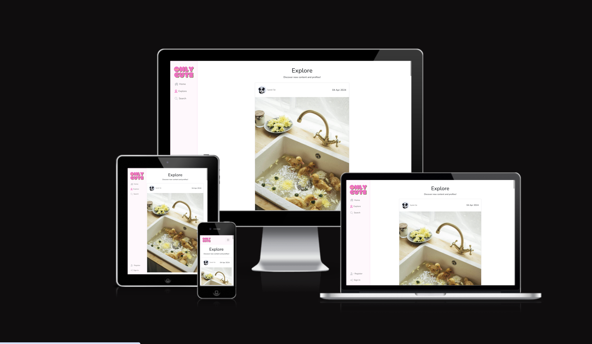
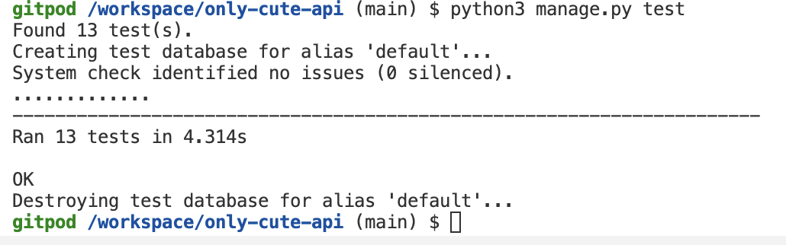
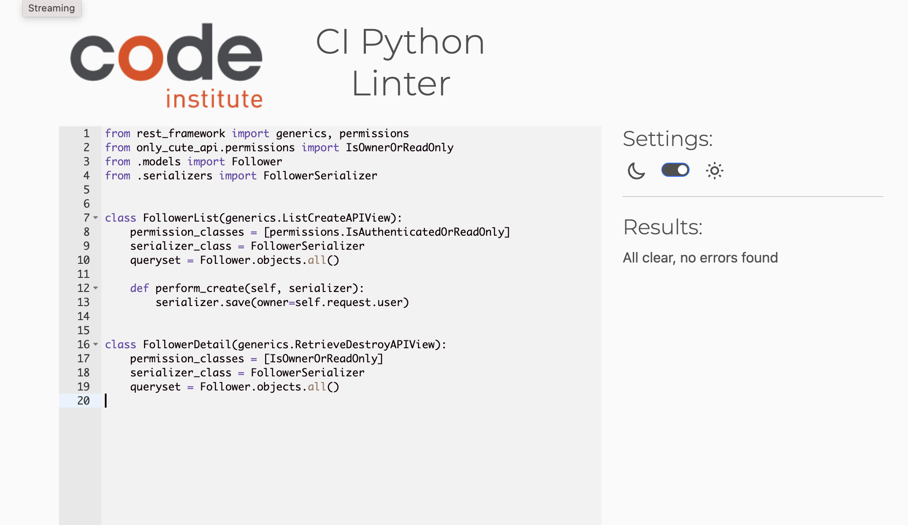

# Only Cute
  
Only Cute is a photo sharing platform for authenticated users to share cute images with other people. Logged in users can post, like, save and comment on post and edit/delete posts they've created. Logged in users are also able to follow other users in doing their home feed will be populated by the posts from the poeple the logged in user has followed.

# Live Page
[https://only-cute-95810adc5d9f.herokuapp.com/](https://only-cute-95810adc5d9f.herokuapp.com/)

# Objective
The objective of this project is to present my skills in React, Django Rest Framework and Python. I wanted to create a simple app with easy-to-use handy functions for the user to easily navigate through the site.

# React Frontend
The repository for the frontend of the application can be found here: [https://github.com/AlmaBroman/only-cute](https://github.com/AlmaBroman/only-cute)

# Contents
* [Endpoints](#endpoints)
  * [Authentication](#authentication)
    * [Registration](#registration)
  * [Profiles](#profiles)
    * [Profiles List](#profiles-list)
    * [Profile Detail](#profile-detail)
  * [Posts](#posts) 
    * [Posts List](#posts-list)
    * [Post Detail](#post-detail)
  * [Comments](#comments) 
    * [Comments List](#comments-list)
    * [Comment Detail](#comment-detail)
  * [Likes](#likes)
    * [Likes List](#likes-list)
    * [Like Detail](#like-detail)
  * [Followers](#followers)
    * [Followers List](#followers-list)
    * [Follower Detail](#follower-detail)
  * [Saved Posts](#saved-posts)
    * [Saved Posts List](#saved-posts-list)
    * [Saved Post Detail](#saved-post-detail)
* [Testing](#testing)
  * [Manual Testing](#manual-testing)
  * [Automated Testing](#automated-testing)
  * [Validation](#validation)
    * [Python](#python)
  * [Bugs](#bugs)
* [Development process](#development-process)
  * [Development Preparation](#development-preparation)
  * [Agile Development](#agile-development)
    * [Custom Fields](#custom-fields)
  * [Git](#git)
* [Deployment](#deployment)
  * [Deployment Preparation](#deployment-preparation)
  * [Setup](#setup)
* [Credits](#credits)
  * [Used Technologies and Tools](#used-technologies-and-tools)
  * [Django Apps](#django-apps)
  * [Content and Media](#content-and-media)
* [Acknowledgments](#acknowledgments)

# Endpoints

## Authentication

### [Registration](https://only-cute-api-2dbb94224813.herokuapp.com/dj-rest-auth/registration/)
/dj-rest-auth/registration/
- POST: creates a new user

## Profiles

### [Profiles List](https://only-cute-api-2dbb94224813.herokuapp.com/profiles/)
/profiles
- GET: returns a list of all the profiles

### [Profile Detail](https://only-cute-api-2dbb94224813.herokuapp.com/profiles/1/)
/profiles/:id
- GET: returns the profile specified by id

## Posts

### [Posts List](https://only-cute-api-2dbb94224813.herokuapp.com/posts/)
/posts
- GET: returns a list of all the posts
- POST: allows authenticated users to create posts

### [Post Detail](https://only-cute-api-2dbb94224813.herokuapp.com/posts/3/)
/posts/:id
- GET: returns the post specified by id
- PUT: allows the owner to update the post
- DELETE: allows the owner to delete the post

## Comments

### [Comments List](https://only-cute-api-2dbb94224813.herokuapp.com/comments/)
/comments
- GET: returns a list of all the comments
- POST: allows authenticated users to create comments on a specified post

### [Comment Detail](https://only-cute-api-2dbb94224813.herokuapp.com/comments/3/)
/comments/:id
- GET: returns the comment specified by id
- PUT: allows the owner to update the comment
- DELETE: allows the owner to delete the comment

## Likes

### [Likes List](https://only-cute-api-2dbb94224813.herokuapp.com/likes/)
/likes
- GET: returns a list of all the likes
- POST: allows authenticated users to create likes on a specified post

### [Like Detail](https://only-cute-api-2dbb94224813.herokuapp.com/likes/7/)
/likes/:id
- GET: returns the like specified by id
- DELETE: allows the owner to delete the like

## Followers

### [Followers List](https://only-cute-api-2dbb94224813.herokuapp.com/followers/)
/followers
- GET: returns a list of all the followers
- POST: allows authenticated users to follow a specified user

### [Follower Detail](https://only-cute-api-2dbb94224813.herokuapp.com/followers/2/)
/followers/:id
- GET: returns the follow specified by id
- DELETE: allows the owner to delete the follow

## Saved Posts

### [Saved Posts List](https://only-cute-api-2dbb94224813.herokuapp.com/saved_posts/)
/saved_posts/:id
- GET: returns a list of all the saved posts
- POST: allows authenticated users to save a specified post

### [Saved Post Detail](https://only-cute-api-2dbb94224813.herokuapp.com/saved_posts/4/)
/saved_posts/:id
- GET: returns the saved post specified by id
- DELETE: allows the owner to delete the saved post

# Testing
I used two types of tests: Manual testing and automated tests.

## Manual Testing
- Throughout the development process, I manually tested every page and feature exhaustively.   
[List of manual tests](manual_testing.md)

## Automated Testing
- For the Post and Profile model, I implemented tests with the Django framework. and the Django Rest Framework
- I started the Django tests with the command `python3 manage.py test`.

Test results from the Django tests: All 13 tests passed.  

## Validation
### Python
  
There were no errors found in any of my python files using the [Python Linter provided by the Code Institute](https://pep8ci.herokuapp.com/).

## Bugs

### Fixed Bugs
| Bug | Description     | Solution             |
| :-----: | :-----------: |:---------------------------------:|
| **Image deafult overriding user uploaded image on put request**  | When making a put request for updating the post or profile data with existing values for image, the updated data would 'forget' the existing image and instead put the default image.  | This turned out to be an issue with the djangorestframework 3.15, solved by upgrading to djangorestframework 3.15.1 |

### Unsolved Bugs
The developer has fixed all the bugs that has been found so far.

# Development process
While working on this project, I tried to follow an agile development approach as much as possible. 

## Development Preparation
The first step in my development process was to plan the website thoroughly:
- At first, I created a simple class diagram that shows the models I was planning on implementing, with their properties and relations  
  [Image of the class diagram](docs/images/db-models.png)
- Next, I thought about the User Interface and its layout. I created simple wireframes for the homepage and the article detail page. 
  - Note: During development, the layout for some of the pages were modified.
- Lastly, I wrote the majority of my user stories and tasks in my [GitHub Project](https://github.com/users/AlmaBroman/projects/6/views/1?visibleFields=%5B%22Title%22%2C84473290%2C84475478%5D) 

### Agile Development
- In my [GitHub Project](https://github.com/users/AlmaBroman/projects/6/views/11), all my issues are separated into two parts of the application by a custom field "App". Each ticket was assigned one of two milestones: "MVP" and "Additional Features"
- Issues not necessary for my project were added to the "Additional Features" milestone. Those tickets were only to be worked on when all the "MVP" tickets were done and I still had time left.
- Each issue was then categorized into user stories or technical tasks by adding the corresponding label.
- All the issues were then grouped into various epics by a custom field "Epic".
- When I was working on the project, I chose one issue to work on from the "Todo" column of the MVP board and moved it into the "In Progress" column.
- After I finished the issue by fulfilling all the acceptance criteria, I  moved it into the "Done" Column.

### Git
- I started the program and repository by using the [gitpod python template](https://github.com/Code-Institute-Org/python-essentials-template) provided by the Code Insitute.
- Then I regularly staged my changes using the command `git add .` and then committed the staged changes to my local repository using `git commit -m 'short descriptive message here'`.
- Finally, I would push the commits from my local repository up to the GitHub repository using the command `git push`.
- With every push, Heroku automatically deploys my latest commit from the 'main' branch to the Heroku app.

# Deployment

The site was deployed using Heroku.

## Deployment Preparation
Before the deployment, the following steps were taken to prepare the application for the deployment on Heroku:
- The setting DEBUG in the settings.py was set to "DEBUG = 'DEV' in os.environ" and "os.environ['DEV'] = '1'" in env.py.
- All the dependencies were stored in the requirements.txt file with the command `pip3 freeze --local > requirements.txt`.
- The start command for the application `web: gunicorn only_cute_api.wsgi` was stored in a Procfile.

## Setup
The steps to deploy an app to Heroku are as follows:
- Create a new App from the Heroku dashboard.
- Enter a name for the app and select a region, then click on "Create App".
- On the page of the app that opens, go to the "Settings" tab.
- In Settings add the necessary config vars, for this project I added my cloudinary URL, database URL, client origin URL and django secret key
- Next, add the buildpack "Heroku/Python".
- Afterwards, go to the "Deploy" tab on the app page.
- In the "Deployment method" section, select "GitHub" and follow the steps to connect Heroku with GitHub.
- Then, in the "Connect to GitHub" section, search for the repository that is supposed to be deployed and click on "Connect".
- The last step is to either:
    - enable automatic deployment by clicking on the button "Enable Automatic Deploys" in the "Automatic Deploys" Section.
    - deploy a branch manually by selecting the branch and clicking the button "Deploy Branch" in the "Manual deploys" section.

The live link can be found here: [Only Cute API](https://only-cute-api-2dbb94224813.herokuapp.com/)

# Credits

## Used Technologies and Tools
- [Django Rest Framwork](https://www.django-rest-framework.org/) - As the project framework
- [Heroku](https://www.heroku.com/) - For the deployment of the website
- [ElephantSQL](https://www.elephantsql.com/) - As the database provider
- [Cloudinary](https://cloudinary.com/) - As the image storage

## Django Apps
- [dj_rest_auth](https://pypi.org/project/dj-rest-auth/) was used for handling registration
- [django-allauth](https://pypi.org/project/django-allauth/) was used for handling registration
- [django-cors-headers](https://pypi.org/project/django-cors-headers/) was used for adding CORS headers to responses
- [rest-framework-simplejwt](https://pypi.org/project/rest-framework-simplejwt/) was used for authentication
- [cloudinary_storage and cloudinary](https://pypi.org/project/django-cloudinary-storage/) was used as the image storage

## Other
- This project was based on the drf and the moments walktrough from Code Institute. I have used the walktrough projects as a starting off point and then modified them accordingly to suit my project.

# Acknowledgements

I would like to acknowledge the following people who have helped me along the way in completing my final portfolio project:
- Akshat Garg, for mentoring me and for his guidance and inspiration.
- John Rearden, from CI tutor support who helped me solve the issue with the default images.
- My friends and family for testing the website and sharing posts and writing comments.